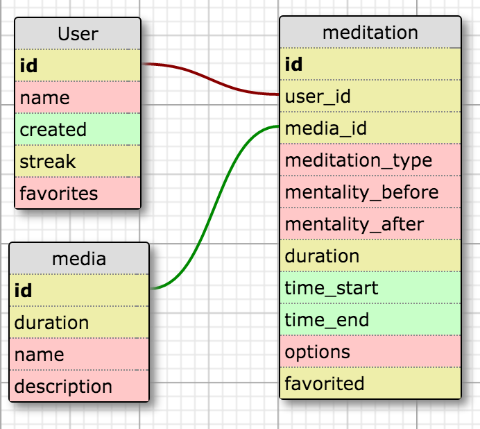

# Conscious World

This app will help people start out or supplement their existing meditation practice with a mix of traditional and creative techniques. You'll be able to save your favorites, rate them, see what else is popular and even upload your own content.

## User Stories

The following **required** functionality is completed:
- [x] User will be able to choose the type of meditation
- [x] User will be able to choose the length of meditation
- [] User will be able to listen to guided meditations
- [] User will be able to listen to ambient sounds
- [x] User will be able to have silence with audio reminders at time intervals so they can keep track of time
- [x] User will be able to chant and have the illusion of being surrounded by others chanting
- [] User will be able to discover new meditations
- [] User will be prompted to take an action upon launch the app based on it either being the first lauch or what they did last time

The following **optional** features are implemented:
- [] User will be able to record their state of mind before and after each session
- [] User will be able to see a visualization of their practice/progress
- [] User will be able to screencast w/ airplay
- [] User will be able to favorie meditations/media

The following **bonus** features are implemented:
- [] Apple TV Guided Mediation browse and listen
- [] User will be able to record meditations
- [] User will be able to do live guided meditation
- [] User can share mediation with others
- [] User can follow other users
- [] Apple watch 
- [] User can comment on other meditations
- [] User can like other mediations

### Video Walkthrough

### Data Schema

To update, copy the dataSchema.xml file and load it [at this url](http://ondras.zarovi.cz/sql/demo/)
